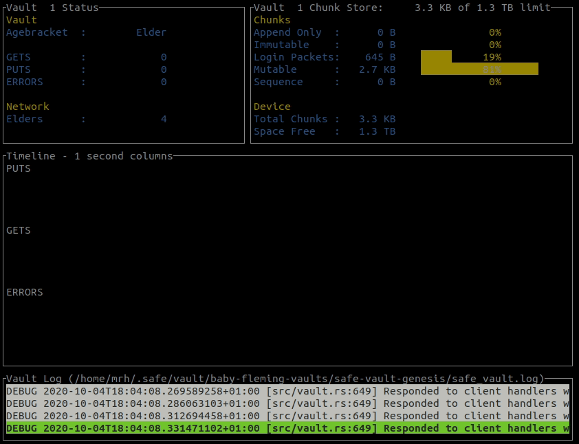

# Autononomi node Dashboard

`vdash` is a terminal based dashboard for monitoring Autononomi nodes. It is written in
Rust, the terminal GUI is implemented using [ratatui](https://github.com/ratatui-org/ratatui) and it monitors one or more node logfiles using [linemux](https://github.com/jmagnuson/linemux).

**Status:** working on Windows, MacOS and Linux with public and local test networks.

`vdash` can monitor multiple logfiles on the local machine, showing multiple metrics for each node including number of PUTS (chunks stored), current price being charged for storage, and node earnings. Many metrics appear both as numeric values and can be viewed in real-time graphical charts over time.

## Discussion and Bug Reports
A Autononomi forum topic is the main forum for discussion: [Vdash - Node dashboard for Autonomi nodes](https://forum.autonomi.community/t/vdash-dashboard-for-autonomi-nodes/32630?u=happybeing)

Bug reports and feature requests can be made in [github issues](https://github.com/happybeing/vdash/issues).

## Remote Monitoring
Remote logfiles could be monitored by using `rsyslog` to mirror them to the machine running `vdash`. This would allow multiple remote machines to be monitored from one machine.
 I have not tried using `rsylog` but have monitored nodes on a remote machine by using `tail` over `ssh` to mirror a remote logfile to the machine running `vdash`.

Here's an early `vdash` (v0.2.0) working with a local testnet node:


## Features
`vdash` will load historic metrics from one or more Safe node
logfiles and display these with live updates in the terminal (see above). A list of keyboard commands is available by pressing '?', some of which are described below for the *Summary* and *Node Status* screens.

### Summary of Monitored Nodes
**'arrow keys':** The up and down arrows select a row, containing data for one particular node. The left and right arrows select a column heading and sorts rows by the values in the selected column.

**'space':** Pressing the space bar toggles sort of the selected column between ascending and descending.

**'enter':** Switches the display to show *Node Status* of the node of the highlighted row.

**'q':** Press 'q' to quit.

**'?':** Shows help.

### Node Status
**'enter'** Switches the display back to the *Summary of Monitored Nodes*.

**'arrow keys':** The left and right arrows shift the single node display between different nodes.

**'i' and 'o':** Zoom the timeline scale in/out using 'i' and 'o' (or '+' and '-').

**'t' and 'T':** If some timelines are not displayed due to lack of vertical space you can cycle
through the timelines to bring them into view by pressing 't' (forward) and 'T'
(backward).

**'m' or 'M':** The Storage Cost timeline displays minimum, mean and maximum
values in each time-slot. To cycle through the min, mean and max displays
press 'm' or 'M'.

**'q':** Press 'q' to quit.

**'?':** Shows help.

## Operating Systems
- **Linux:** works on Linux (tested on Ubuntu).
- **Windows:** works on Windows 10 and 11. Not tested recently.
- **MacOS:** works on MacOS. Not tested recently.

## Install using Linux package manager

`vdash` has been packaged for debian thanks to the generous efforts of Jonas Smedegaard. From 2024 it will begin to be available in many downstream Linux distributions, but due to the pace of updates the packaged version is likely to be behind the version published at crates.io which is always up to date.

You can check the status of package `safe-vdash` in your distribution and choose whether to install from there or get the most recent version as explained below.

## Install from crates.io

You must first install Rust. This applies to Windows, Linux and Mac so start with step 1 and then select the subsequent section for your operating system.

1 Install **Rust** via https://doc.rust-lang.org/cargo/getting-started/installation.html

2a. **Linux (Ubuntu)**

    sudo apt-get install build-essential

2b. **Linux/MacOS** install **vdash:**

    cargo install vdash
    vdash --help

2c. **Windows** install **vdash:**

To install `vdash` on Windows 10 and 11 from crates.io you will need to install the Microsoft Visual C++ Redistributables for Visual Studio. If you have Visual Studio installed this will already be installed, but if you are using Visual Studio Code you still need to install the following.

- Got to https://visualstudio.microsoft.com/downloads/
- scroll down to "All Downloads" and click "Other Tools, Frameworks, and Redistributables"
- click on "Build Tools for Visual Studio"
- under "Microsoft Visual C++ Redistributable for Visual Studio" choose from x64, ARM64 and x86
- Click download and then run the VC 'Redist' installer

Finally to install `vdash`:

    cargo install vdash
    vdash --help

## Using vdash - a Autononomi node Dashboard
`vdash` provides a terminal based graphical dashboard of Autononomi node activity on the local machine. It parses input from one or more node logfiles to gather live node metrics which are displayed using terminal graphics.


## Get Autononomi pre-requisites
1. **Get the Autonomi Node Applications:** There are two options for running nodes at the launch of the beta on 5th June 2024. The `node-launchpad` is a simple terminal based UI (TUI) and the `safenode-manager` is command line program for 'power users', although the community can help you use either. See https://autonomi.com for details of how to obtain these apps and join the beta.

2. **Start your Autonomi Nodes:** See https://docs.autonomi.com for documentation and join the [forum](https://forum.autonomi.community) if you need help.

If you have also installed `vdash` you can test it by running it on the same machine you are using to run nodes on the Autonomi beta network.

## vdash Usage:

For help:

    vdash --help

Typically you can just pass the paths of one or more node logfiles you want to monitor. For example, to run `vdash` first start your Autononomi node(s) with on of the Autonomi Node Applications (see above).

Then, start `vdash`. You can give a path to one or more logfiles. You can also use `-g` to specify a glob path. When you provide a glob path you can press 'r' to re-scan the path for logfiles after starting more nodes.

The path to logfiles vary depending on which Autonomi Node Application you are using, and also on your operating system. The following are just examples so you will need to provide paths for your particular setup.

**Linux:**

    vdash -g "/home/<USERNAME>/.local/share/safe/node/safenode*/logs/safenode.log"

**Mac:**

    vdash "/Users/<USERNAME>/Library/Application Support/safe/node/*/logs/safenode.log"

**Windows:**

When running nodes with `safenode-launchpad`:

    vdash C:\ProgramData\safenode\logs\safenode*\safenode.log

Or if running `safenode` binary directly:

    vdash C:\Users\<USERNAME>\AppData\Roaming\safe\node\*\logs\safenode.log


Keyboard commands for `vdash` are summarised in the introduction above.

### vdash and 'glob' paths

`vdash` accepts one or more file paths, but you can also specify one or more 'glob' paths which can scan a directory tree for matching files. This enables you to pick up new nodes added after `vdash` starts, either using the 'r' (re-scan) keyboard command, or automatically by giving a re-scanning period using the `--glob-scan` option on the command line.

`vdash` scans all 'glob' paths provided on start-up and again whenever you press 'r'.

Note that unlike a file path you must use quotation marks around a 'glob' path to prevent the shell from trying to expand it. In the examples you will need to replace `<USER>` with the appropriate home directory name for your account.

Example for Linux:

    vdash --glob-path "$HOME/.local/share/safe/node/safenode*/logs/safenode.log"

Using double rather than single quotes enables you to use '$HOME' in the path instead of giving the home directory explicitly.

The path to logfiles vary depending on which Autonomi Node Application you are using, and also on your operating system. The following are just examples so you will need to provide paths for your particular setup.

### Display of Token values
`vdash` shows node earnings and storage cost in terms of Autononomi tokens as 'nanos' or billionths of a token. It can though
be made to display token values in a local currency (e.g. U.S. dollar, British pound etc). For this it needs
a way to obtain the conversion rate for the currency and be told what symbol to use in the
display (e.g. "$", "£" etc.).

You can do this by passing fixed values on the command line, or have
`vdash` obtain live values using one of the supported web APIs.

### Currency on the Command Line
Two options allow you to specify the conversion rate and symbol for your chosen currency.

For example, for a token value of 1.23 U.S. dollars you would use the following command line options:

```
--currency-symbol "$" --currency-token-rate 1.23
```

You can use the above to provide a default conversion and have live prices override this when available.

For more type `vdash --help`.

### Live Prices via Web API
`vdash` can obtain the Autononomi token price in a specified currency from the
Coingecko.com or Coinmarketcap.com web APIs provided you have an access key for the corresponding API. At this time, both offer both paid and free/demo API
keys which you obtain by signing up for an account with those websites.

If you have keys for one or both of these services you must pass them to `vdash` on the command line as shown below.

In both cases a default polling interval is set by `vdash` that will not exceed the advertised number of API requests for a free API key, although this polling interval can be shortened by specifying the polling interval on the command line.

For more type `vdash --help`.

#### Coingecko.com
To have `vdash` obtain the token rate from Coingecko.com include the following on the command line and replace `YOUR-API-KEY` with the API key you obtained from the service.

```sh
--currency-apiname "GBP" --currency-symbol "£" --coingecko-key "YOUR-API-KEY"
```

#### Coinmarketcap.com
To have `vdash` obtain the token rate from Coinmarketcap.com include the following on the command line and replace `YOUR-API-KEY` with the API key you obtained from the service.

```sh
--currency-apiname "GBP" --currency-symbol "£" --coinmarketcap-key "YOUR-API-KEY"
```

### Using vdash to Monitor Autonomi Nodes

Start your nodes using an Autonomi Node Application.

When your node or nodes have started, run `vdash`, typically in a different terminal:
```sh
vdash --glob-path "$HOME/.local/share/safe/node/*/safenode.log"
```
Modify the above example for your setup, and include any additional command line options as required.

For example, to enable display of earnings and storage costs using local currency:
```sh
vdash --currency-apiname "USD" --currency-symbol "$" --glob-path "$HOME/.local/share/safe/node/*/logs/safenode.log"
```
### What to Expect
When you start `vdash` it shows the main summary. This shows a list of all nodes being monitored with several statistics for each node. At the top is a summary for all those nodes.

Use the left/right arrow keys and space-bar to sort by each column, up/down to select a node and enter to see details about a particular node. Use '?' to see all keyboard commands.

### Are My Nodes Working?
It won't be immediately obvious whether your nodes are working correctly, but things to look for are explained below.

Firstly, don't worry about the number of Errors. You will have a lot and that is normal! What you should see fairly quickly are non-zero values for GETS, PUTS, Peers. RAM will start at around 40-60MB but can rise and fall as node activity varies.

Later you should also begin to see numbers of Records, but Earnings and Store Cost may stay at zero for quite some time depending on the amount of data being uploaded, and the number of other nodes competing to store that data. Eventually you should see Store Cost values for some nodes, and eventually some Earned Nanos.

### Using vdash With a Local Test Network

First clone the Autononomi repository and change directory into the cloned copy and checkout branch `stable`:

```sh
git clone https://github.com/maidsafe/safe_network
cd safe_network
git checkout stable
```

Then start a local test network using the instructions [here](https://github.com/maidsafe/safe_network/#run-your-maidsafe-local-test-network-in-4-easy-steps).

You can then start `vdash` to display the status of the nodes in that network as follows:

```sh
vdash --currency-apiname "USD" --currency-symbol "$" --glob-path "$HOME/.local/share/safe/node/*/logs/safenode.log"
```

If you return to the instructions [here](https://github.com/maidsafe/safe_network/#run-your-maidsafe-local-test-network-in-4-easy-steps) you can obtain some tokens to pay for your file uploads, and try uploading some files again using the instructions at that link, and monitor the activity of your test network nodes using `vdash`.

## Build (for Developers Only)

See [Get Autononomi Pre-requisites](#get-autonomi-pre-requisites).

### Get code
```
git clone https://github.com/happybeing/vdash
cd vdash
```

### Build - Linux / MacOS / Windows 10
Note: MacOS and Windows are untested but may 'just work' - please report success or failure in an issue.
```
cargo build --release
```
If built for target 'musl' `vdash` uses considerably less memory:

```sh
rustup target add x86_64-unknown-linux-musl
cargo build --release --target x86_64-unknown-linux-musl
```
Comparing memory use (using `htop` on Linux):
```sh
VIRT   RES  SHR
803M  9372 4716 x13 threads (release)
32768 6848 2440 x13 threads (release/musl)
```
Note: the above figures are out of date but illustrate the point.

## LICENSE

Everything is AGPL3.0 unless otherwise stated. Any contributions are accepted on the condition they conform to this license.

See also [./LICENSE](./LICENSE)